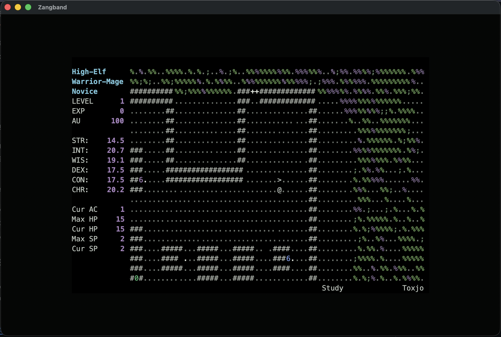

# Zangband Mac App

This repo is an active macOS port of **Zangband 2.7.6**, the old-school
Angband variant with Amber, chaos, mutations, wilderness, weird monsters, and
the specific kind of unfairness that made 90s roguelikes worth remembering.

The goal is simple:

> make Zangband feel at home on a modern Mac without sanding off what makes it
> Zangband.

Right now this builds a double-clickable `.app` bundle that runs the original
game core, renders it in a native Cocoa window, and fixes several 64-bit macOS
portability issues.



## Upstream

This work is based on the original Zangband source repository:

https://github.com/jjnoo/Zangband

That repository preserves the historical C codebase. This fork focuses on
making it playable and pleasant on modern macOS.

## What Works

- Native macOS `.app` bundle at `macos/build/Zangband.app`
- Cocoa fixed-grid renderer
- Bundled game binary and game data
- Writable runtime data under `~/Library/Application Support/Zangband`
- Keyboard input routed through the app window
- Native menus for:
  - New Game
  - Restart
  - Bigger Text
  - Smaller Text
  - Actual Size
  - Fullscreen
- Stable 80x24 logical game grid, so resizing the Mac window does not corrupt
  the old curses UI
- Mac-specific terrain palette, so floors, trees, dirt, grass, rock, water,
  lava, and swamp read as environment instead of bright terminal foreground
- 64-bit macOS RNG/type-sizing fix for character generation

## Current Architecture

The current app is intentionally pragmatic.

The game still runs through the existing curses backend (`zangband -mgcu`) inside
a pseudo-terminal. The macOS app parses the terminal output, keeps a native cell
grid, and draws that grid with AppKit.

This gives us a usable Mac app quickly while keeping the original game core
intact.

The next major step is a direct Cocoa or Metal `z-term` backend, replacing the
pty/curses bridge entirely. That is the path to a truly high-performance native
port.

## Build

From the repo root:

```sh
./configure --with-x11=no
make
make -C macos
```

Then launch:

```sh
open macos/build/Zangband.app
```

For terminal play without the app:

```sh
TERM=xterm-256color ANGBAND_PATH="$PWD/lib" ./zangband -mgcu
```

## macOS Runtime Data

On first launch, the app copies the bundled `lib` directory to:

```sh
~/Library/Application Support/Zangband/lib
```

The game runs with `ANGBAND_PATH` pointed at that writable copy, so save files,
scores, generated raw data, and player state do not need to be written inside
the app bundle.

## Why This Exists

Old open-source games should not stay trapped on dead platforms.

Zangband has a great core: dense systems, strange tone, huge item/monster data,
and a very specific flavor of roguelike chaos. The original source is still
here. Modern Macs are fast. The missing piece is care.

This repo is that care.

## Roadmap

### Near Term

- Add app icon and signed/notarized release artifacts
- Improve keyboard handling for Mac conventions
- Add save/open UX around the existing savefile system
- Add screenshots and release builds
- Add regression tests for macOS portability fixes

### Native Renderer

- Replace pty/curses with a direct Cocoa `z-term` backend
- Draw dirty cells directly from the game core
- Move from AppKit text drawing to a faster renderer if needed
- Add optional tiles while keeping ASCII first-class

### LLM Experiments

The fun direction: make the dungeon remember you.

Ideas under consideration:

- Dungeon Chronicle: short generated run journal entries
- Death Eulogies: tomb inscriptions and post-run obituaries
- Living Monster Speech: contextual barks and taunts
- Rumor Engine: personalized rumors and scroll text
- Artifact Lore: optional generated history for special items
- Oracle Mode: visible-info-only explanations for new players

The rule: LLMs can add atmosphere and reflection, but deterministic gameplay
stays deterministic.

## Notes for Contributors

This is legacy C. Expect old assumptions.

The original code predates modern 64-bit macOS conventions, so portability fixes
should be small, explicit, and tested against actual gameplay paths. The macOS
app should stay a thin layer until the direct `z-term` backend is ready.

Generated build files and local app bundles are ignored. Source changes should
stay in:

- `src/` for game/core fixes
- `macos/` for the native app target
- `lib/` only when intentionally changing game data

## License and Attribution

Zangband descends from Moria and Angband. The original source files retain their
historical copyright and distribution notices.

This fork keeps those notices intact and credits the upstream Zangband source at
https://github.com/jjnoo/Zangband.
